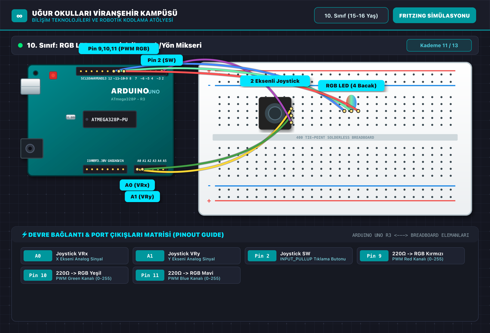

# 🤖 10. Sınıf: RGB LED ve Joystick ile Renk/Yön Mikseri
**Uğur Okulları Viranşehir Kampüsü — K-12 Bilişim & Robotik Kodlama Atölyesi**
*Düzey:* 10. Sınıf (15-16 Yaş) | *Seviye:* Kademe 11 / 13

---

## 📸 Fritzing Devre & Breadboard Simülasyon Şeması

Aşağıdaki şema, projenin breadboard ve Arduino Uno üzerindeki tam kablo ve pin bağlantılarını göstermektedir:

*(Vektörel SVG formatı için: [circuit_diagram.svg](circuit_diagram.svg))*

---

## 🔌 Detaylı Port Bağlantı Tablosu (Pinout)

| Arduino Pini | Bileşen Bacağı | Görev / Açıklama |
|:---|:---|:---|
| **`A0`** | Joystick VRx | X Ekseni Analog Sinyal |
| **`A1`** | Joystick VRy | Y Ekseni Analog Sinyal |
| **`Pin 2`** | Joystick SW | INPUT_PULLUP Tıklama Butonu |
| **`Pin 9`** | 220Ω -> RGB Kırmızı | PWM Red Kanalı (0-255) |
| **`Pin 10`** | 220Ω -> RGB Yeşil | PWM Green Kanalı (0-255) |
| **`Pin 11`** | 220Ω -> RGB Mavi | PWM Blue Kanalı (0-255) |

---

## 📁 Proje Dosyaları
- **Kaynak Kod:** [`Sinif_10_Joystick_RGB_Mikser.ino`](Sinif_10_Joystick_RGB_Mikser.ino)
- **Devre Şeması (PNG):** [`circuit_diagram.png`](circuit_diagram.png)
- **Vektörel Şema (SVG):** [`circuit_diagram.svg`](circuit_diagram.svg)

---
*Uğur Okulları Viranşehir Kampüsü Bilişim Teknolojileri ve İnovasyon Laboratuvarı*
