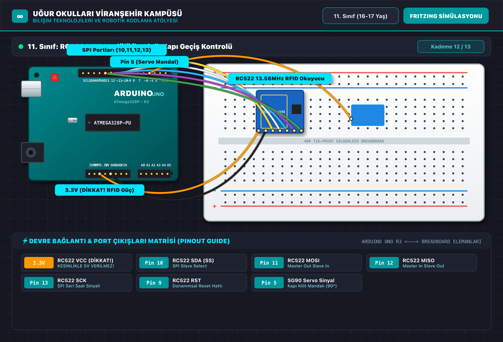

# 🤖 11. Sınıf: RC522 RFID Modülü ile Akıllı Kapı Geçiş Kontrolü
**Uğur Okulları Viranşehir Kampüsü — K-12 Bilişim & Robotik Kodlama Atölyesi**
*Düzey:* 11. Sınıf (16-17 Yaş) | *Seviye:* Kademe 12 / 13

---

## 📸 Fritzing Devre & Breadboard Simülasyon Şeması

Aşağıdaki şema, projenin breadboard ve Arduino Uno üzerindeki tam kablo ve pin bağlantılarını göstermektedir:

*(Vektörel SVG formatı için: [circuit_diagram.svg](circuit_diagram.svg))*

---

## 🔌 Detaylı Port Bağlantı Tablosu (Pinout)

| Arduino Pini | Bileşen Bacağı | Görev / Açıklama |
|:---|:---|:---|
| **`3.3V`** | RC522 VCC (DİKKAT!) | KESİNLİKLE 5V VERİLMEZ! |
| **`Pin 10`** | RC522 SDA (SS) | SPI Slave Select |
| **`Pin 11`** | RC522 MOSI | Master Out Slave In |
| **`Pin 12`** | RC522 MISO | Master In Slave Out |
| **`Pin 13`** | RC522 SCK | SPI Seri Saat Sinyali |
| **`Pin 9`** | RC522 RST | Donanımsal Reset Hattı |
| **`Pin 5`** | SG90 Servo Sinyal | Kapı Kilit Mandalı (90°) |

---

## 📁 Proje Dosyaları
- **Kaynak Kod:** [`Sinif_11_RFID_Kapi_Gecis.ino`](Sinif_11_RFID_Kapi_Gecis.ino)
- **Devre Şeması (PNG):** [`circuit_diagram.png`](circuit_diagram.png)
- **Vektörel Şema (SVG):** [`circuit_diagram.svg`](circuit_diagram.svg)

---
*Uğur Okulları Viranşehir Kampüsü Bilişim Teknolojileri ve İnovasyon Laboratuvarı*
