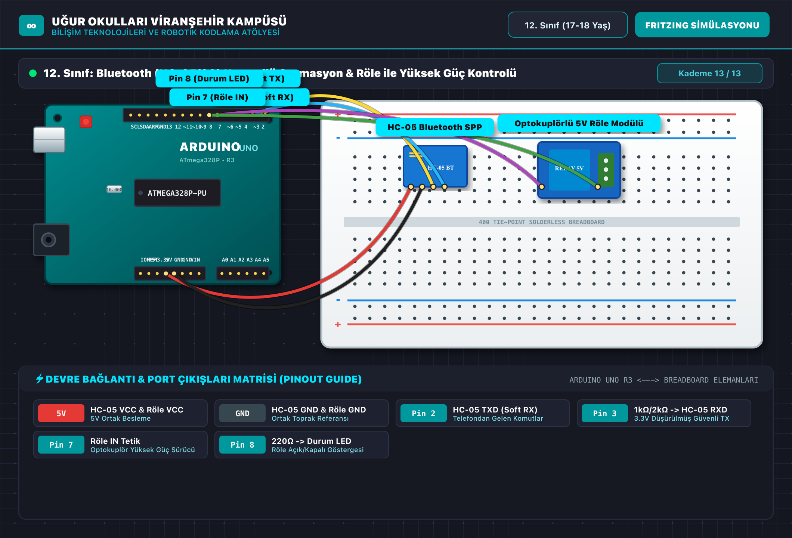

# 🤖 12. Sınıf: Bluetooth (HC-05/06) Kontrollü Otomasyon & Röle ile Yüksek Güç Kontrolü
**Uğur Okulları Viranşehir Kampüsü — K-12 Bilişim & Robotik Kodlama Atölyesi**
*Düzey:* 12. Sınıf (17-18 Yaş) | *Seviye:* Kademe 13 / 13

---

## 📸 Fritzing Devre & Breadboard Simülasyon Şeması

Aşağıdaki şema, projenin breadboard ve Arduino Uno üzerindeki tam kablo ve pin bağlantılarını göstermektedir:

*(Vektörel SVG formatı için: [circuit_diagram.svg](circuit_diagram.svg))*

---

## 🔌 Detaylı Port Bağlantı Tablosu (Pinout)

| Arduino Pini | Bileşen Bacağı | Görev / Açıklama |
|:---|:---|:---|
| **`5V`** | HC-05 VCC & Röle VCC | 5V Ortak Besleme |
| **`GND`** | HC-05 GND & Röle GND | Ortak Toprak Referansı |
| **`Pin 2`** | HC-05 TXD (Soft RX) | Telefondan Gelen Komutlar |
| **`Pin 3`** | 1kΩ/2kΩ -> HC-05 RXD | 3.3V Düşürülmüş Güvenli TX |
| **`Pin 7`** | Röle IN Tetik | Optokuplör Yüksek Güç Sürücü |
| **`Pin 8`** | 220Ω -> Durum LED | Röle Açık/Kapalı Göstergesi |

---

## 📁 Proje Dosyaları
- **Kaynak Kod:** [`Sinif_12_Bluetooth_Role_Otomasyon.ino`](Sinif_12_Bluetooth_Role_Otomasyon.ino)
- **Devre Şeması (PNG):** [`circuit_diagram.png`](circuit_diagram.png)
- **Vektörel Şema (SVG):** [`circuit_diagram.svg`](circuit_diagram.svg)

---
*Uğur Okulları Viranşehir Kampüsü Bilişim Teknolojileri ve İnovasyon Laboratuvarı*
