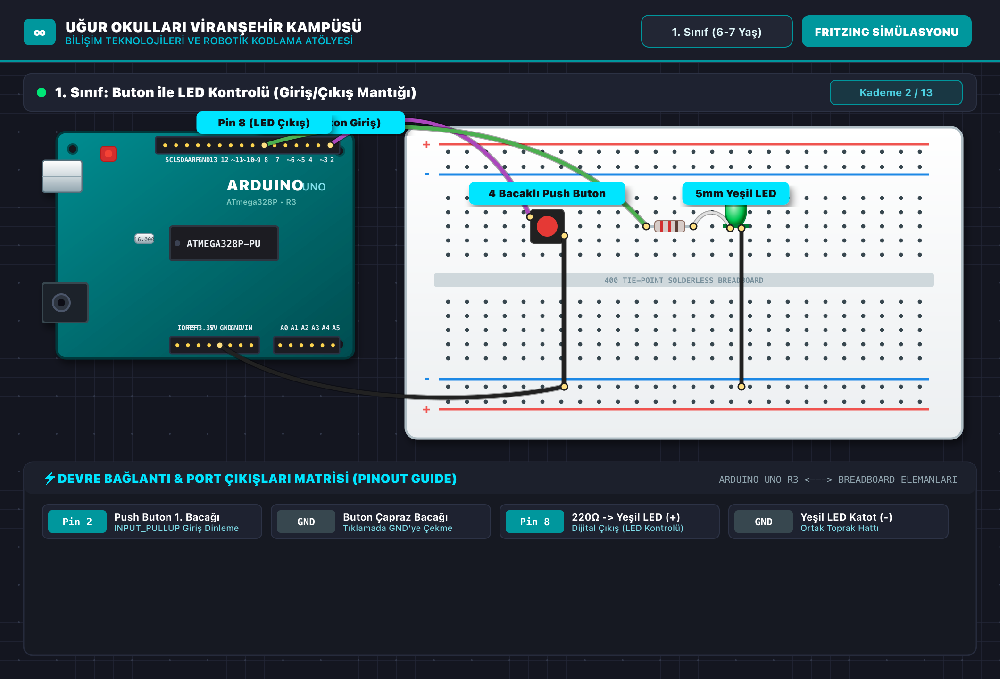

# 🤖 1. Sınıf: Buton ile LED Kontrolü (Giriş/Çıkış Mantığı)
**Uğur Okulları Viranşehir Kampüsü — K-12 Bilişim & Robotik Kodlama Atölyesi**
*Düzey:* 1. Sınıf (6-7 Yaş) | *Seviye:* Kademe 2 / 13

---

## 📸 Fritzing Devre & Breadboard Simülasyon Şeması

Aşağıdaki şema, projenin breadboard ve Arduino Uno üzerindeki tam kablo ve pin bağlantılarını göstermektedir:

*(Vektörel SVG formatı için: [circuit_diagram.svg](circuit_diagram.svg))*

---

## 🔌 Detaylı Port Bağlantı Tablosu (Pinout)

| Arduino Pini | Bileşen Bacağı | Görev / Açıklama |
|:---|:---|:---|
| **`Pin 2`** | Push Buton 1. Bacağı | INPUT_PULLUP Giriş Dinleme |
| **`GND`** | Buton Çapraz Bacağı | Tıklamada GND'ye Çekme |
| **`Pin 8`** | 220Ω -> Yeşil LED (+) | Dijital Çıkış (LED Kontrolü) |
| **`GND`** | Yeşil LED Katot (-) | Ortak Toprak Hattı |

---

## 📁 Proje Dosyaları
- **Kaynak Kod:** [`Sinif_1_Buton_LED.ino`](Sinif_1_Buton_LED.ino)
- **Devre Şeması (PNG):** [`circuit_diagram.png`](circuit_diagram.png)
- **Vektörel Şema (SVG):** [`circuit_diagram.svg`](circuit_diagram.svg)

---
*Uğur Okulları Viranşehir Kampüsü Bilişim Teknolojileri ve İnovasyon Laboratuvarı*
