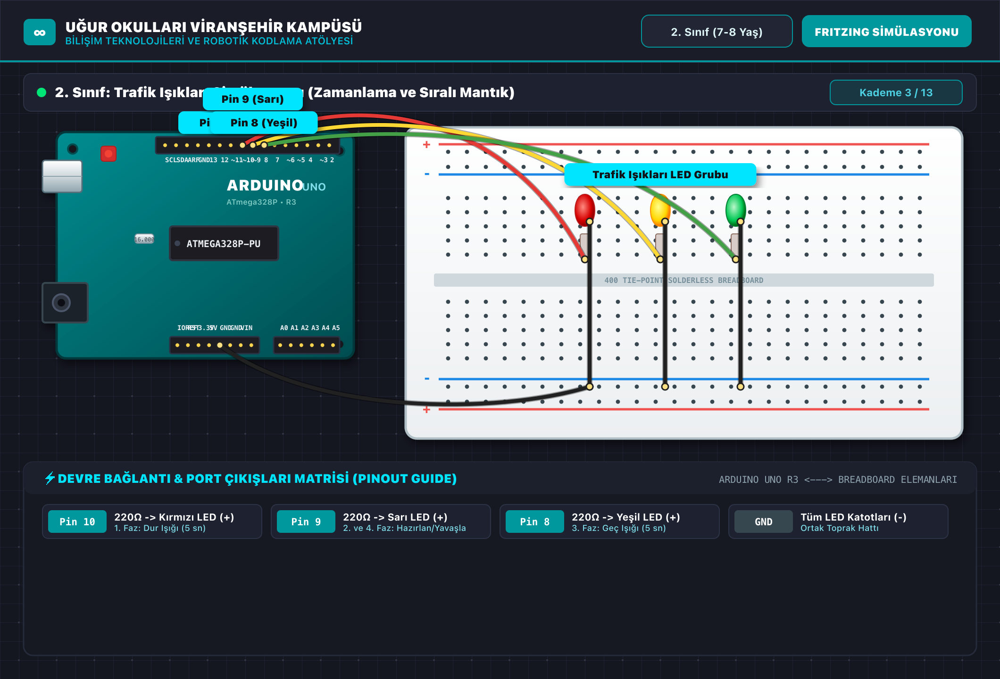

# 🤖 2. Sınıf: Trafik Işıkları Simülasyonu (Zamanlama ve Sıralı Mantık)
**Uğur Okulları Viranşehir Kampüsü — K-12 Bilişim & Robotik Kodlama Atölyesi**
*Düzey:* 2. Sınıf (7-8 Yaş) | *Seviye:* Kademe 3 / 13

---

## 📸 Fritzing Devre & Breadboard Simülasyon Şeması

Aşağıdaki şema, projenin breadboard ve Arduino Uno üzerindeki tam kablo ve pin bağlantılarını göstermektedir:

*(Vektörel SVG formatı için: [circuit_diagram.svg](circuit_diagram.svg))*

---

## 🔌 Detaylı Port Bağlantı Tablosu (Pinout)

| Arduino Pini | Bileşen Bacağı | Görev / Açıklama |
|:---|:---|:---|
| **`Pin 10`** | 220Ω -> Kırmızı LED (+) | 1. Faz: Dur Işığı (5 sn) |
| **`Pin 9`** | 220Ω -> Sarı LED (+) | 2. ve 4. Faz: Hazırlan/Yavaşla |
| **`Pin 8`** | 220Ω -> Yeşil LED (+) | 3. Faz: Geç Işığı (5 sn) |
| **`GND`** | Tüm LED Katotları (-) | Ortak Toprak Hattı |

---

## 📁 Proje Dosyaları
- **Kaynak Kod:** [`Sinif_2_Trafik_Isiklari.ino`](Sinif_2_Trafik_Isiklari.ino)
- **Devre Şeması (PNG):** [`circuit_diagram.png`](circuit_diagram.png)
- **Vektörel Şema (SVG):** [`circuit_diagram.svg`](circuit_diagram.svg)

---
*Uğur Okulları Viranşehir Kampüsü Bilişim Teknolojileri ve İnovasyon Laboratuvarı*
