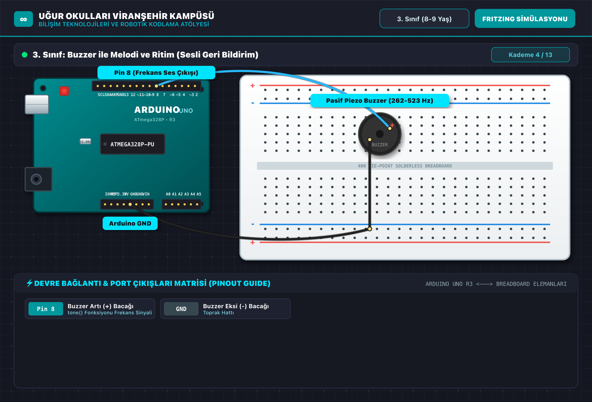

# 🤖 3. Sınıf: Buzzer ile Melodi ve Ritim (Sesli Geri Bildirim)
**Uğur Okulları Viranşehir Kampüsü — K-12 Bilişim & Robotik Kodlama Atölyesi**
*Düzey:* 3. Sınıf (8-9 Yaş) | *Seviye:* Kademe 4 / 13

---

## 📸 Fritzing Devre & Breadboard Simülasyon Şeması

Aşağıdaki şema, projenin breadboard ve Arduino Uno üzerindeki tam kablo ve pin bağlantılarını göstermektedir:

*(Vektörel SVG formatı için: [circuit_diagram.svg](circuit_diagram.svg))*

---

## 🔌 Detaylı Port Bağlantı Tablosu (Pinout)

| Arduino Pini | Bileşen Bacağı | Görev / Açıklama |
|:---|:---|:---|
| **`Pin 8`** | Buzzer Artı (+) Bacağı | tone() Fonksiyonu Frekans Sinyali |
| **`GND`** | Buzzer Eksi (-) Bacağı | Toprak Hattı |

---

## 📁 Proje Dosyaları
- **Kaynak Kod:** [`Sinif_3_Buzzer_Melodi.ino`](Sinif_3_Buzzer_Melodi.ino)
- **Devre Şeması (PNG):** [`circuit_diagram.png`](circuit_diagram.png)
- **Vektörel Şema (SVG):** [`circuit_diagram.svg`](circuit_diagram.svg)

---
*Uğur Okulları Viranşehir Kampüsü Bilişim Teknolojileri ve İnovasyon Laboratuvarı*
