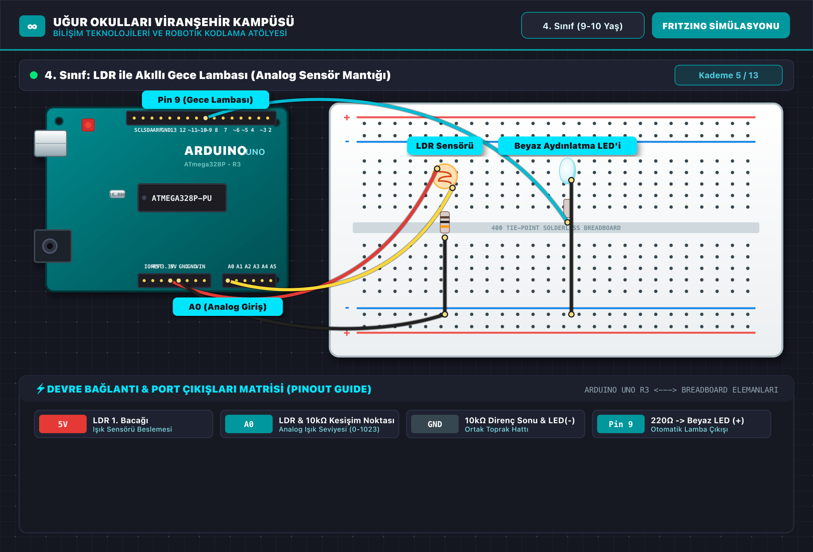

# 🤖 4. Sınıf: LDR ile Akıllı Gece Lambası (Analog Sensör Mantığı)
**Uğur Okulları Viranşehir Kampüsü — K-12 Bilişim & Robotik Kodlama Atölyesi**
*Düzey:* 4. Sınıf (9-10 Yaş) | *Seviye:* Kademe 5 / 13

---

## 📸 Fritzing Devre & Breadboard Simülasyon Şeması

Aşağıdaki şema, projenin breadboard ve Arduino Uno üzerindeki tam kablo ve pin bağlantılarını göstermektedir:

*(Vektörel SVG formatı için: [circuit_diagram.svg](circuit_diagram.svg))*

---

## 🔌 Detaylı Port Bağlantı Tablosu (Pinout)

| Arduino Pini | Bileşen Bacağı | Görev / Açıklama |
|:---|:---|:---|
| **`5V`** | LDR 1. Bacağı | Işık Sensörü Beslemesi |
| **`A0`** | LDR & 10kΩ Kesişim Noktası | Analog Işık Seviyesi (0-1023) |
| **`GND`** | 10kΩ Direnç Sonu & LED(-) | Ortak Toprak Hattı |
| **`Pin 9`** | 220Ω -> Beyaz LED (+) | Otomatik Lamba Çıkışı |

---

## 📁 Proje Dosyaları
- **Kaynak Kod:** [`Sinif_4_LDR_Akilli_Gece_Lambasi.ino`](Sinif_4_LDR_Akilli_Gece_Lambasi.ino)
- **Devre Şeması (PNG):** [`circuit_diagram.png`](circuit_diagram.png)
- **Vektörel Şema (SVG):** [`circuit_diagram.svg`](circuit_diagram.svg)

---
*Uğur Okulları Viranşehir Kampüsü Bilişim Teknolojileri ve İnovasyon Laboratuvarı*
