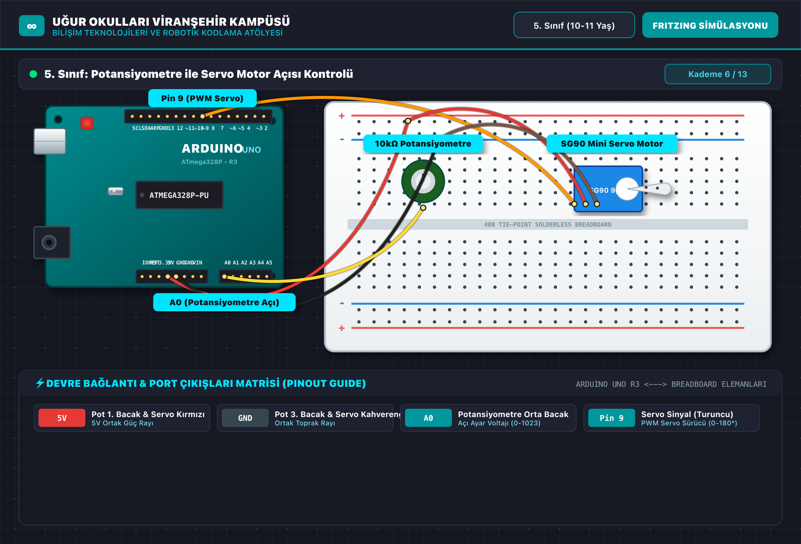

# 🤖 5. Sınıf: Potansiyometre ile Servo Motor Açısı Kontrolü
**Uğur Okulları Viranşehir Kampüsü — K-12 Bilişim & Robotik Kodlama Atölyesi**
*Düzey:* 5. Sınıf (10-11 Yaş) | *Seviye:* Kademe 6 / 13

---

## 📸 Fritzing Devre & Breadboard Simülasyon Şeması

Aşağıdaki şema, projenin breadboard ve Arduino Uno üzerindeki tam kablo ve pin bağlantılarını göstermektedir:

*(Vektörel SVG formatı için: [circuit_diagram.svg](circuit_diagram.svg))*

---

## 🔌 Detaylı Port Bağlantı Tablosu (Pinout)

| Arduino Pini | Bileşen Bacağı | Görev / Açıklama |
|:---|:---|:---|
| **`5V`** | Pot 1. Bacak & Servo Kırmızı | 5V Ortak Güç Rayı |
| **`GND`** | Pot 3. Bacak & Servo Kahverengi | Ortak Toprak Rayı |
| **`A0`** | Potansiyometre Orta Bacak | Açı Ayar Voltajı (0-1023) |
| **`Pin 9`** | Servo Sinyal (Turuncu) | PWM Servo Sürücü (0-180°) |

---

## 📁 Proje Dosyaları
- **Kaynak Kod:** [`Sinif_5_Potansiyometre_Servo.ino`](Sinif_5_Potansiyometre_Servo.ino)
- **Devre Şeması (PNG):** [`circuit_diagram.png`](circuit_diagram.png)
- **Vektörel Şema (SVG):** [`circuit_diagram.svg`](circuit_diagram.svg)

---
*Uğur Okulları Viranşehir Kampüsü Bilişim Teknolojileri ve İnovasyon Laboratuvarı*
