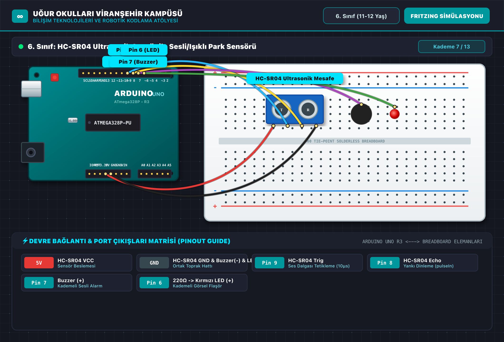

# 🤖 6. Sınıf: HC-SR04 Ultrasonik Sensör ile Sesli/Işıklı Park Sensörü
**Uğur Okulları Viranşehir Kampüsü — K-12 Bilişim & Robotik Kodlama Atölyesi**
*Düzey:* 6. Sınıf (11-12 Yaş) | *Seviye:* Kademe 7 / 13

---

## 📸 Fritzing Devre & Breadboard Simülasyon Şeması

Aşağıdaki şema, projenin breadboard ve Arduino Uno üzerindeki tam kablo ve pin bağlantılarını göstermektedir:

*(Vektörel SVG formatı için: [circuit_diagram.svg](circuit_diagram.svg))*

---

## 🔌 Detaylı Port Bağlantı Tablosu (Pinout)

| Arduino Pini | Bileşen Bacağı | Görev / Açıklama |
|:---|:---|:---|
| **`5V`** | HC-SR04 VCC | Sensör Beslemesi |
| **`GND`** | HC-SR04 GND & Buzzer(-) & LED(-) | Ortak Toprak Hattı |
| **`Pin 9`** | HC-SR04 Trig | Ses Dalgası Tetikleme (10µs) |
| **`Pin 8`** | HC-SR04 Echo | Yankı Dinleme (pulseIn) |
| **`Pin 7`** | Buzzer (+) | Kademeli Sesli Alarm |
| **`Pin 6`** | 220Ω -> Kırmızı LED (+) | Kademeli Görsel Flaşör |

---

## 📁 Proje Dosyaları
- **Kaynak Kod:** [`Sinif_6_HCSR04_Park_Sensoru.ino`](Sinif_6_HCSR04_Park_Sensoru.ino)
- **Devre Şeması (PNG):** [`circuit_diagram.png`](circuit_diagram.png)
- **Vektörel Şema (SVG):** [`circuit_diagram.svg`](circuit_diagram.svg)

---
*Uğur Okulları Viranşehir Kampüsü Bilişim Teknolojileri ve İnovasyon Laboratuvarı*
