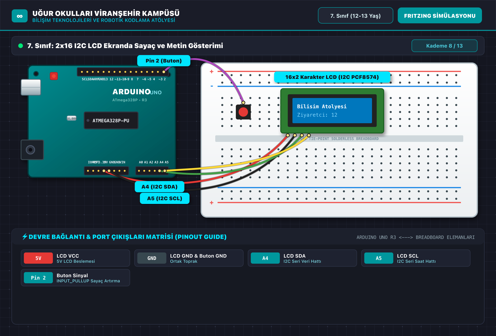

# 🤖 7. Sınıf: 2x16 I2C LCD Ekranda Sayaç ve Metin Gösterimi
**Uğur Okulları Viranşehir Kampüsü — K-12 Bilişim & Robotik Kodlama Atölyesi**
*Düzey:* 7. Sınıf (12-13 Yaş) | *Seviye:* Kademe 8 / 13

---

## 📸 Fritzing Devre & Breadboard Simülasyon Şeması

Aşağıdaki şema, projenin breadboard ve Arduino Uno üzerindeki tam kablo ve pin bağlantılarını göstermektedir:

*(Vektörel SVG formatı için: [circuit_diagram.svg](circuit_diagram.svg))*

---

## 🔌 Detaylı Port Bağlantı Tablosu (Pinout)

| Arduino Pini | Bileşen Bacağı | Görev / Açıklama |
|:---|:---|:---|
| **`5V`** | LCD VCC | 5V LCD Beslemesi |
| **`GND`** | LCD GND & Buton GND | Ortak Toprak |
| **`A4`** | LCD SDA | I2C Seri Veri Hattı |
| **`A5`** | LCD SCL | I2C Seri Saat Hattı |
| **`Pin 2`** | Buton Sinyal | INPUT_PULLUP Sayaç Artırma |

---

## 📁 Proje Dosyaları
- **Kaynak Kod:** [`Sinif_7_I2C_LCD_Sayac.ino`](Sinif_7_I2C_LCD_Sayac.ino)
- **Devre Şeması (PNG):** [`circuit_diagram.png`](circuit_diagram.png)
- **Vektörel Şema (SVG):** [`circuit_diagram.svg`](circuit_diagram.svg)

---
*Uğur Okulları Viranşehir Kampüsü Bilişim Teknolojileri ve İnovasyon Laboratuvarı*
