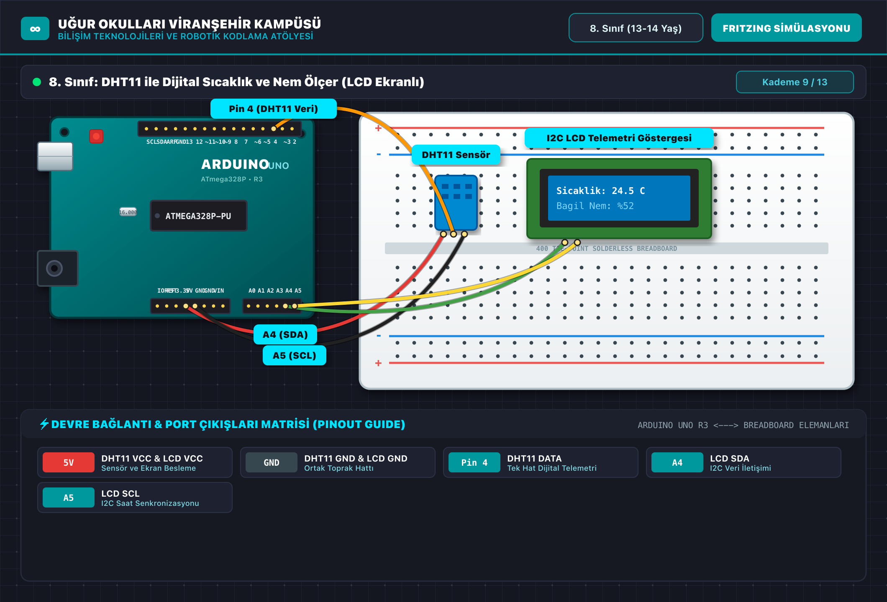

# 🤖 8. Sınıf: DHT11 ile Dijital Sıcaklık ve Nem Ölçer (LCD Ekranlı)
**Uğur Okulları Viranşehir Kampüsü — K-12 Bilişim & Robotik Kodlama Atölyesi**
*Düzey:* 8. Sınıf (13-14 Yaş) | *Seviye:* Kademe 9 / 13

---

## 📸 Fritzing Devre & Breadboard Simülasyon Şeması

Aşağıdaki şema, projenin breadboard ve Arduino Uno üzerindeki tam kablo ve pin bağlantılarını göstermektedir:

*(Vektörel SVG formatı için: [circuit_diagram.svg](circuit_diagram.svg))*

---

## 🔌 Detaylı Port Bağlantı Tablosu (Pinout)

| Arduino Pini | Bileşen Bacağı | Görev / Açıklama |
|:---|:---|:---|
| **`5V`** | DHT11 VCC & LCD VCC | Sensör ve Ekran Besleme |
| **`GND`** | DHT11 GND & LCD GND | Ortak Toprak Hattı |
| **`Pin 4`** | DHT11 DATA | Tek Hat Dijital Telemetri |
| **`A4`** | LCD SDA | I2C Veri İletişimi |
| **`A5`** | LCD SCL | I2C Saat Senkronizasyonu |

---

## 📁 Proje Dosyaları
- **Kaynak Kod:** [`Sinif_8_DHT11_LCD_Termometre.ino`](Sinif_8_DHT11_LCD_Termometre.ino)
- **Devre Şeması (PNG):** [`circuit_diagram.png`](circuit_diagram.png)
- **Vektörel Şema (SVG):** [`circuit_diagram.svg`](circuit_diagram.svg)

---
*Uğur Okulları Viranşehir Kampüsü Bilişim Teknolojileri ve İnovasyon Laboratuvarı*
