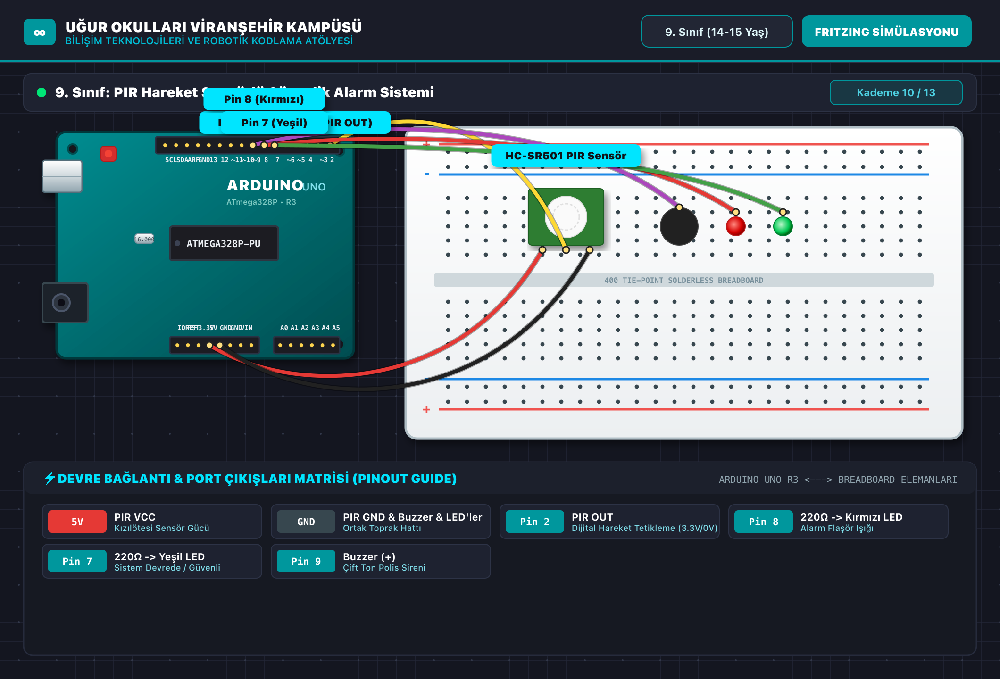

# 🤖 9. Sınıf: PIR Hareket Sensörlü Güvenlik Alarm Sistemi
**Uğur Okulları Viranşehir Kampüsü — K-12 Bilişim & Robotik Kodlama Atölyesi**
*Düzey:* 9. Sınıf (14-15 Yaş) | *Seviye:* Kademe 10 / 13

---

## 📸 Fritzing Devre & Breadboard Simülasyon Şeması

Aşağıdaki şema, projenin breadboard ve Arduino Uno üzerindeki tam kablo ve pin bağlantılarını göstermektedir:

*(Vektörel SVG formatı için: [circuit_diagram.svg](circuit_diagram.svg))*

---

## 🔌 Detaylı Port Bağlantı Tablosu (Pinout)

| Arduino Pini | Bileşen Bacağı | Görev / Açıklama |
|:---|:---|:---|
| **`5V`** | PIR VCC | Kızılötesi Sensör Gücü |
| **`GND`** | PIR GND & Buzzer & LED'ler | Ortak Toprak Hattı |
| **`Pin 2`** | PIR OUT | Dijital Hareket Tetikleme (3.3V/0V) |
| **`Pin 8`** | 220Ω -> Kırmızı LED | Alarm Flaşör Işığı |
| **`Pin 7`** | 220Ω -> Yeşil LED | Sistem Devrede / Güvenli |
| **`Pin 9`** | Buzzer (+) | Çift Ton Polis Sireni |

---

## 📁 Proje Dosyaları
- **Kaynak Kod:** [`Sinif_9_PIR_Guvenlik_Alarmi.ino`](Sinif_9_PIR_Guvenlik_Alarmi.ino)
- **Devre Şeması (PNG):** [`circuit_diagram.png`](circuit_diagram.png)
- **Vektörel Şema (SVG):** [`circuit_diagram.svg`](circuit_diagram.svg)

---
*Uğur Okulları Viranşehir Kampüsü Bilişim Teknolojileri ve İnovasyon Laboratuvarı*
